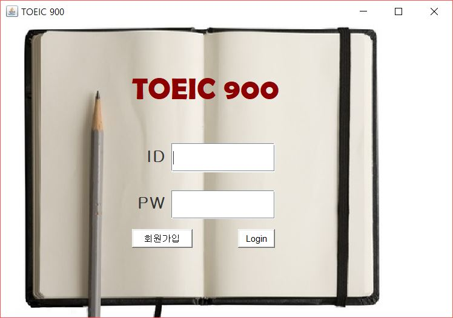
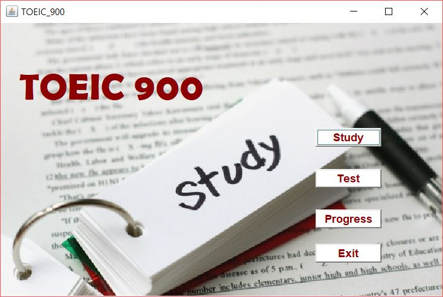
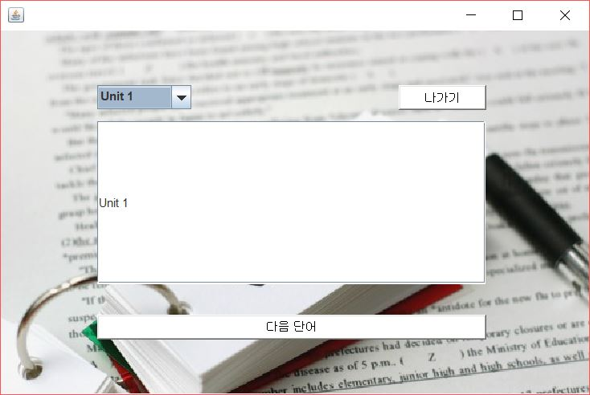
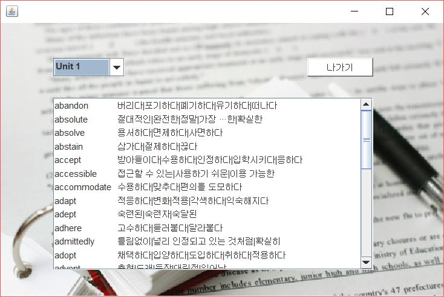
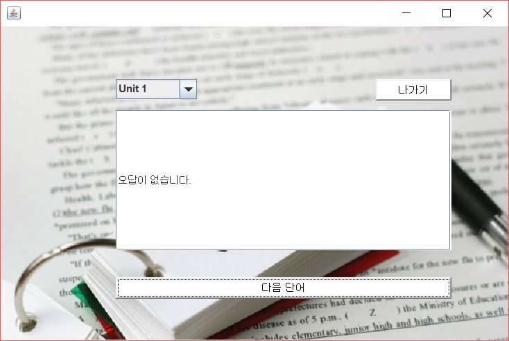
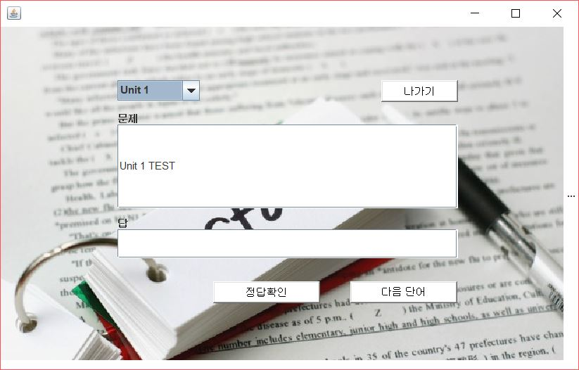
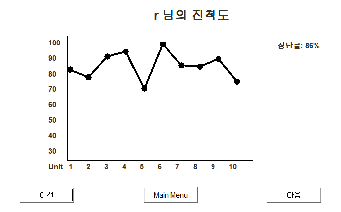
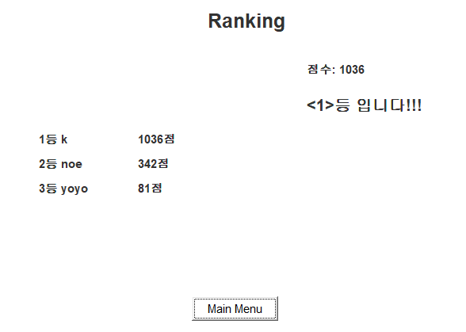

# Vocabulary_project

>This is Vocabulary_project with java  
The project is made for studying DB

### Function
0. Login / MainMenu  

1. Memorize mode  
1.1. Memorizing one words with user's click  
1.2. Memorizing all words with scroll  
1.3. Memorizing one words which was user's wrong answer    

2. Test mode  
2.1. Test one unit  
2.2. Test words of user's wrong answer   

3. Looking Advance mode  
3.1. Looking my all answer ratio by graph   
3.2. Showing Ranking with all users by computing advacne's scores  

